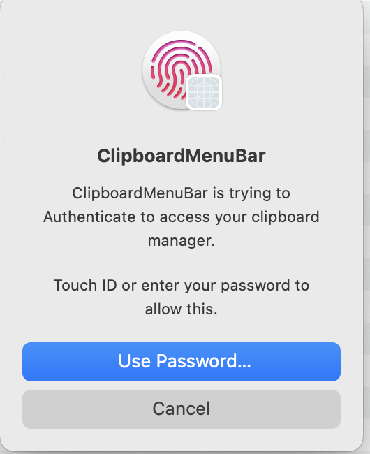
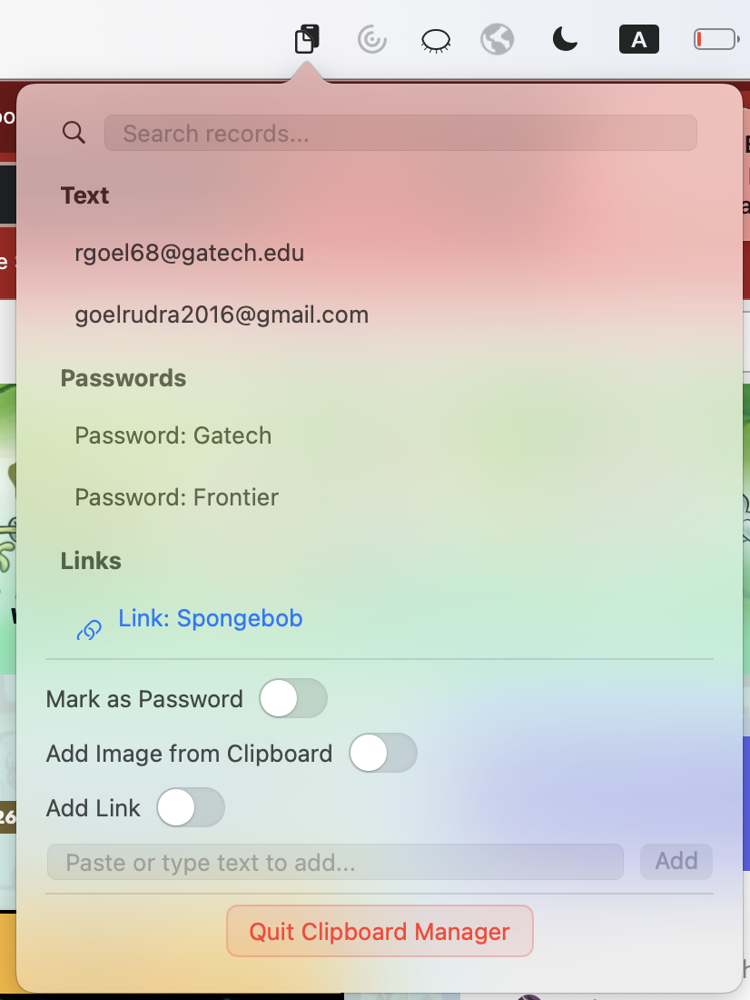

# ClipboardManager

A secure macOS menu bar clipboard manager that stores and organizes your clipboard history. Secured with macOS Keychain and biometric authentication.

## Features

- **Menu Bar Integration**: Convenient access from the macOS menu bar
- **Biometric Authentication**: Secure access using Touch ID, Face ID, or system password
- **Search Functionality**: Real-time search enabled
- **Encrypted Storage**: All data is encrypted and stored securely on your device

## Security

- **Framework**: Uses Apple's `LocalAuthentication` framework for biometric and password authentication
- **Encryption**: Data is encrypted using `CryptoKit` with ChaCha20-Poly1305 authenticated encryption
- **Key Storage**: Encryption keys are securely stored in the system Keychain
- **Local Only**: All data stays on your device

## Supported Record Types

- **Text**: Plain text snippets and content
- **Passwords**: Securely store passwords with custom aliases
- **Images**: Save images from clipboard with descriptive aliases
- **Links**: Store URLs with custom aliases for easy access

## How to Use

1. Launch the app and authenticate with Touch ID/Face ID or your system password
2. Click the clipboard icon in the menu bar to open the manager
3. Add new items by:
   - Typing or pasting text directly
   - Toggling "Mark as Password" for sensitive text
   - Toggling "Add Image from Clipboard" to save clipboard images
   - Toggling "Add Link" to save URLs with custom names
4. Search through your saved items using the search bar
5. Click any item to copy it back to your clipboard
6. Hover over items to reveal delete and link-opening options

## Requirements

- macOS 14.5 or later
- Touch ID, Face ID, or system password for authentication

## Installation

1. Download the latest release ZIP file from the [Releases](../../releases) page
2. Unzip the downloaded file
3. Move the ClipboardManager app to your Applications folder
4. Launch the app and grant necessary permissions when prompted

---

*Your clipboard data is encrypted and stored locally on your device for maximum privacy and security.*
